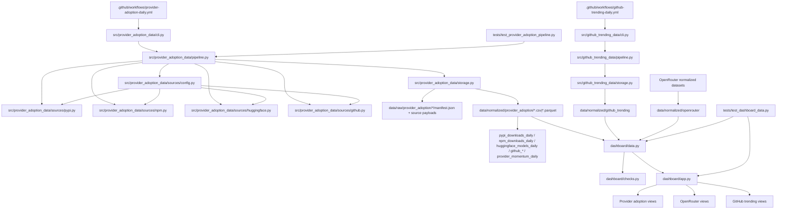

# PROJECT_MAP

## 📅 Daily Progress
- Added npm provider-adoption tracking to `src/provider_adoption_data/`, then expanded it with package categories so core SDKs, agent SDKs, legacy SDKs, and CLIs can be split cleanly in downstream views.
- Added `src/provider_adoption_data/sources/huggingface.py` plus `huggingface_models_daily`, wiring Hugging Face org model telemetry into the same provider-adoption pipeline and dashboard domain.
- Reworked `dashboard/app.py` and `dashboard/data.py` so dashboard views cache against normalized-file signatures, expose the new provider datasets, and render source-specific adoption breakdowns without expensive recomputation on every interaction.

## 🏗️ System Architecture

## 🧠 Context Memo
The provider registry in `src/provider_adoption_data/sources/config.py` is now the control plane for cross-source mapping. Each provider can declare PyPI packages, npm packages, and Hugging Face orgs in one place, which keeps the pipeline extensible without scattering provider-specific rules across multiple source modules.

The npm work added `package_category` on top of `package_type` because raw package counts were too coarse once providers started shipping multiple surfaces. Splitting core SDKs from agent SDKs and CLIs lets the dashboard compare adoption by product shape instead of accidentally summing incompatible distribution channels into one number.

The Hugging Face API does not expose a clean daily-download metric per model, so `run_huggingface_daily_update()` derives `hf_downloads_daily_est` by differencing successive all-time totals for the same `(provider, author, model_id)` before writing `huggingface_models_daily`. That approximation is deliberate: it preserves a daily time series for trend analysis while still storing the raw 30-day and all-time counters for later recalculation if the method changes.

The dashboard performance work moved expensive frame preparation behind cache signatures derived from normalized files and latest manifests. That matters because the app now has more provider-adoption slices to aggregate, and recomputing every pivot on each UI interaction would make the new source expansion noticeably sluggish.

## 🔗 Obsidian Links
- No new `.md` files were created in the last 24 hours.
- `PROJECT_MAP.md` remains the root note that ties workflow entry points, ingestion modules, normalized datasets, and dashboard consumers into one current system view.
