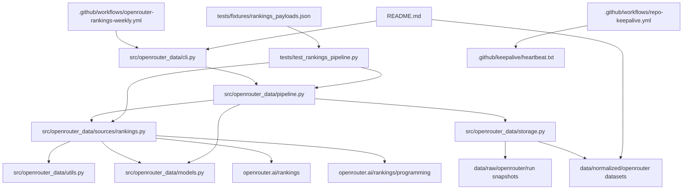

# PROJECT_MAP

## 📅 Daily Progress
- Added the `openrouter_data` package with a CLI, extraction pipeline, storage layer, and tests for OpenRouter rankings ingestion.
- Added scheduled GitHub Actions for weekly scraping plus a separate keepalive job so scheduled workflows do not silently stop on an inactive repository.
- Started tracking normalized OpenRouter outputs in `data/normalized/openrouter/` and updated the weekly workflow to commit dataset refreshes back to the repository.

## 🏗️ System Architecture

## 🧠 Context Memo
The extractor is intentionally built around parsing Next.js `self.__next_f.push(...)` payloads instead of scraping rendered DOM fragments. That is the more stable source of truth for chart data and lets the tests lock onto fixture payloads rather than brittle markup.

`RankingsPipeline._filter_for_mode()` currently treats `weekly-update` and `backfill-missing` the same way: both only append unseen completed weeks. The important detail is the completed-week filter in [`src/openrouter_data/utils.py`](/Users/henrywzh/.codex/worktrees/aa0c/alternative-data/src/openrouter_data/utils.py), which avoids writing partial current-week buckets. The split between `week_anchor="start"` and `week_anchor="end"` exists because OpenRouter labels different charts differently, so each dataset needs its own completeness rule.

The storage layer deduplicates on dataset-specific natural keys before rewriting CSV and Parquet outputs. That keeps reruns idempotent, allows the GitHub Action to commit only real data changes, and preserves a clean analytics surface for downstream use.

## 🔗 Obsidian Links
- No new markdown notes were created in the last 24 hours. The only touched markdown file was [`README.md`](/Users/henrywzh/.codex/worktrees/aa0c/alternative-data/README.md), which documents how the CLI commands produce the normalized datasets written by [`src/openrouter_data/pipeline.py`](/Users/henrywzh/.codex/worktrees/aa0c/alternative-data/src/openrouter_data/pipeline.py) and [`src/openrouter_data/storage.py`](/Users/henrywzh/.codex/worktrees/aa0c/alternative-data/src/openrouter_data/storage.py).
