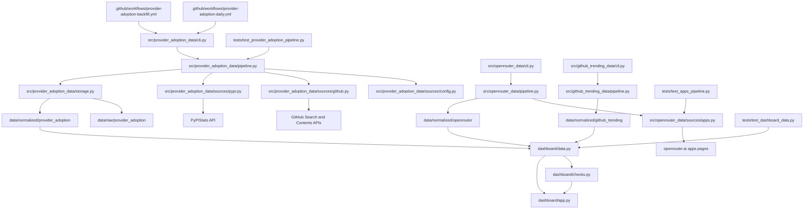

# PROJECT_MAP

## 📅 Daily Progress
- Added the `provider_adoption_data` ingestion stack, including GitHub/PyPI collectors, storage, tests, and daily plus backfill GitHub Actions that persist raw and normalized outputs.
- Reworked the dashboard to treat provider adoption as a first-class domain, simplified the provider view, and invalidated cached state when underlying data files change.
- Expanded OpenRouter app monitoring to include Hermes Agent and refreshed app ranking, trending, usage, and top-model datasets plus related parser coverage.

## 🏗️ System Architecture

## 🧠 Context Memo
The provider-adoption pipeline is intentionally split into candidate repos, first-match signals, repo rollups, and derived momentum. That keeps the raw evidence auditable before it is compressed into a scoring layer, which matters because the GitHub side is heuristic and needs a clear path from search hit to final metric.

The GitHub collector only searches a few language buckets and a bounded set of likely files per repo. That is a deliberate API-budget and precision tradeoff: broad codebase scans would be expensive and would increase false positives, while the current path list still captures the highest-signal dependency, import, env-var, and model-name indicators.

The dashboard cache now fingerprints files under both `data/raw` and `data/normalized` before loading state. Without that signature, Streamlit could keep serving stale provider-adoption or app views even after a workflow committed fresh datasets.

The Hermes Agent monitor in `src/openrouter_data/sources/apps.py` tries the canonical app detail page first and then falls back to the origin-filtered `/apps` URL. That fallback exists because OpenRouter app detail routing is not always stable, but the parser still needs a page that exposes the same analytics payload structure.

## 🔗 Obsidian Links
- No new `.md` files were created in the last 24 hours.
- `README.md` was updated to document the new provider-adoption commands, datasets, and workflow entry points; it is the main note that now links the operational CLIs to `src/provider_adoption_data/`, `src/openrouter_data/`, and `dashboard/app.py`.
