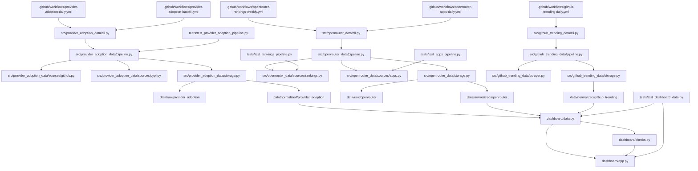

# PROJECT_MAP

## 📅 Daily Progress
- Refined `dashboard/app.py` so OpenRouter rankings explicitly distinguish week-start versus week-end buckets, expose scrape timestamps, and warn when the latest completed buckets diverge.
- Added regression coverage in `tests/test_dashboard_data.py` for UTC scrape formatting and for the week-bucket context logic that drives the new dashboard messaging.
- Refreshed normalized datasets under `data/normalized/provider_adoption/` and `data/normalized/github_trending/`, keeping the dashboard inputs current without changing the ingestion topology.

## 🏗️ System Architecture

## 🧠 Context Memo
The dashboard change is guarding against a semantic mismatch in OpenRouter's own weekly datasets rather than a rendering bug. `top_models` and `categories_programming` are bucketed by week start, while `market_share` is bucketed by week end, so the latest "complete" week can legitimately differ by nearly a full week on the same scrape.

The new context helpers in `dashboard/app.py` centralize that interpretation before any KPIs or labels are rendered. That prevents the UI from implying apples-to-apples weekly alignment where none exists and gives tests a stable place to assert the expected week-selection behavior.

Today's data commits are operational refreshes, not architecture changes. They matter because `dashboard/data.py` reads directly from those normalized outputs, so the project map should record that the dashboard inputs changed even when the pipeline code did not.

## 🔗 Obsidian Links
- No new `.md` files were created in the last 24 hours.
- `PROJECT_MAP.md` remains the root note that ties the workflow entry points, ingestion packages, normalized datasets, and `dashboard/app.py` into one current system view.
