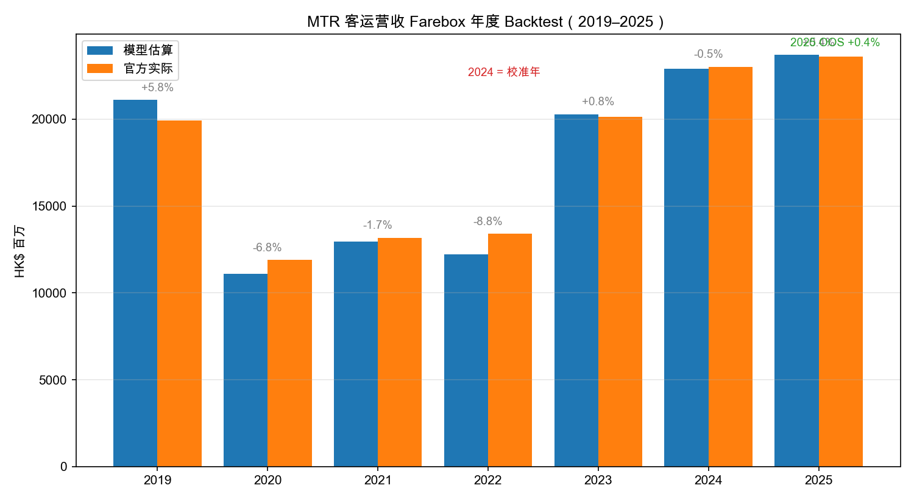
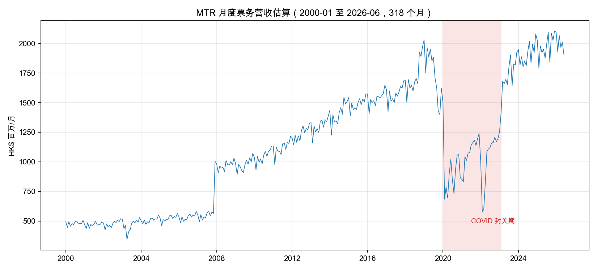
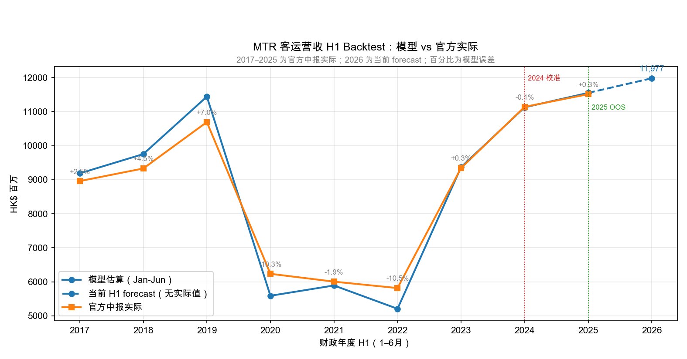
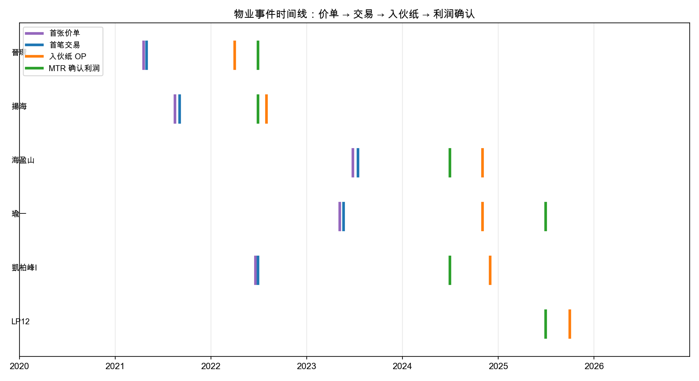
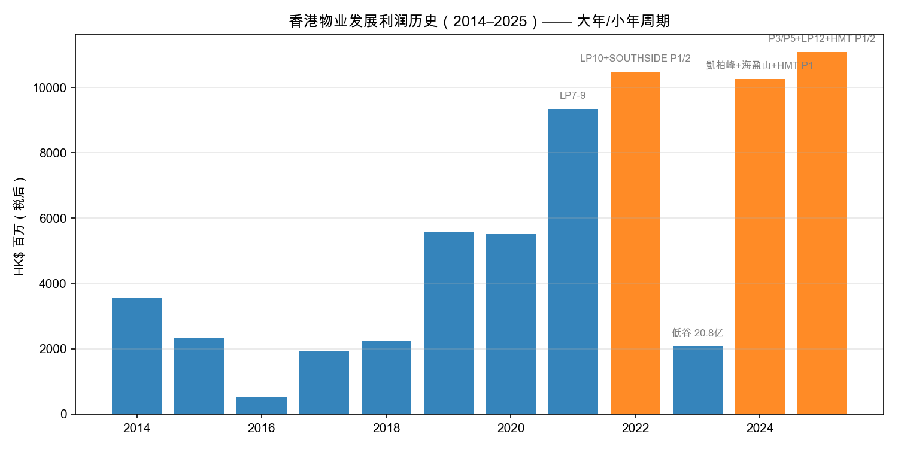
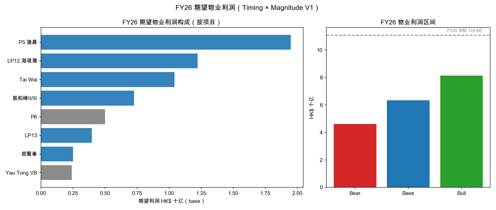
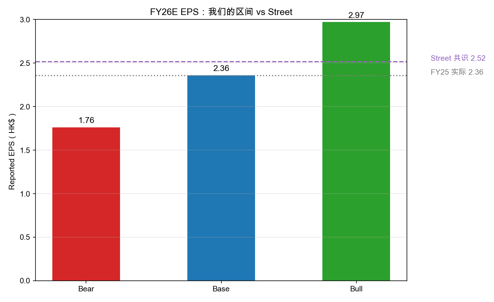

# 港铁（MTR, 66.HK）量化建模报告
**版本**：v1.1 ｜ **日期**：2026-08-11 ｜ **数据截止**：2026-08-11

---

## 一、执行摘要

本报告基于**官方财报 + 政府公开数据 + SRPE 法定交易登记册**构建港铁端到端量化研究栈，覆盖客运营收、物业发展利润、财报预测三大模块：

| 模块 | 核心结果 |
|---|---|
| **客运营收 Nowcast** | 2019–2023 structural replay MAPE **4.06%**；**2025 practical forward validation +0.43%** |
| **客运营收 H1 Backtest** | 2017–2025 官方中报 actuals；2019–2023 H1 structural replay MAPE **5.99%**；**2025 H1 practical forward validation +0.34%**；2026 H1 forecast **HK$11,976.7m** |
| **历史财报桥** | 2010–2025 十六年官方数据，`Underlying = 经常性 + 物业` 勾稽 12/12 年吻合 |
| **物业 Timing** | OP 入伙纸 → 利润确认**同一年**（强映射中位 lag ~1 个月）|
| **物业 Magnitude** | 13 个期数 9,819 笔法定交易，确认利润/货值比锚定 **17–24%** |
| **FY26 预测** | 期望物业利润 **46/63/81 亿**（bear/base/bull）；EPS **1.44/1.71/2.01 vs Street 2.52** |

**核心判断**：FY25（110.8 亿物业利润）是历史周期峰值，FY26 官方点名确认池明显缩小，我们的数据链暗示 EPS 将显著低于 Street 的 +7% 增长预期（−20%~−43%）。该分歧是当前最大的可检验研究边缘。

---

## 二、数据层（全部可溯源）

| 数据集 | 来源 | 覆盖 | 规模 |
|---|---|---|---|
| MTR 月度客流 | mtr.com.hk 投资者页 | 2000-01–2026-06 | 318 个月，5 分部 |
| 入境处每日口岸客流 | immd.gov.hk open data | 2021-01 至今（T+1） | 17 口岸 |
| MTR 历史财报桥 | 官方业绩公告/演示稿 PDF | 2010–2025 | 16 财年 × 20+ 字段 |
| 物业项目 Master | 官方业绩披露 + SHKP 仓库数据 | 2021–2025 披露 | 19 个包 |
| SRPE 交易登记册 | srpe.gov.hk 法定 PDF | 各期开售至今 | **9,819 笔交易 / 13 期数** |
| 屋宇署生命周期 | BD Md51–56 月报 | 2005-01–2026-05 | 17,517 行 |
| Street 共识 | yfinance 0066.HK | 当前 | 7 位分析师 |

**数据质量原则**：所有数字逐一从官方 PDF 核实（曾修正一版含编造数据的半年度数据集）；缺失字段留空不估算；预测假设全部显式标注。

---

## 三、方法链

```
① 客运营收：客流 × 动态 Yield（FAM 累计调整）→ Ridge L2 残差修正
② 财报桥：官方分部收入/利润重构（Underlying = Recurrent + Property）
③ Timing：价单 → 首笔交易 → OP → 确认年/半年度（规则 + 官方中期拆分）
④ Magnitude：SRPE 逐笔交易加总 → 货值 + 价格分布 → 利润/货值比锚点
⑤ 期望利润：E[Profit] = P(确认) × 合格货值 × 15%/20%/25%
⑥ EPS Bridge：期望利润 → Underlying → Reported EPS vs Street
```

---

## 四、客运营收 Backtest

### 4.1 年度回测（2019–2025）



| 年份 | 模型（HK$M）| 官方实际 | 误差 |
|---|---|---|---|
| 2019 | 21,104 | 19,938 | +5.8% |
| 2020 | 11,090 | 11,896 | −6.8% |
| 2021 | 12,954 | 13,177 | −1.7% |
| 2022 | 12,224 | 13,404 | −8.8% |
| 2023 | 20,283 | 20,131 | +0.8% |
| 2024 | 22,908 | 23,013 | −0.5%（校准年）|
| **2025** | **23,696** | **23,595** | **+0.43%（practical forward validation）** |

- Structural replay baseline 物理模型 MAPE：**4.78%**；structural replay Ridge L2 残差模型：**4.06%**。这两项使用 FY2024 yield anchor，且 Ridge leave-one-out 会使用其他年份（包括目标期之后的实际值），不能称为严格 OOS。
- 校准：FY2024 分部收入 ÷ 客流 → 每乘客 yield（domestic 9.06 / 跨境 36.20 / 高铁 124.88 / AEL 61.14 / 轻铁 3.27），经 FAM 累计调整率演进

### 4.2 月度序列（2000–2026）



**已知局限**（如实记录）：2008 跳升 = 两铁合并覆盖变化；COVID 年份低估 7–9%（旅程结构漂移）；2010 年前 yield 恒定。

### 4.3 H1 历史回测：Jan–Jun 模型 vs 官方中报



模型按同一套 FY2024 segment-yield anchor 和 FAM 逻辑，只累加每年 1–6 月；actual 是 MTR
中报披露的 **Hong Kong Transport Operations / Total Revenue**，单位 HK$m。

| H1 | 模型估算 | 官方实际 | 误差 | 角色 |
|---|---:|---:|---:|---|
| 2017 | 9,184.8 | 8,957.0 | +2.5% | 历史结构检查 |
| 2018 | 9,750.5 | 9,328.0 | +4.5% | 历史结构检查 |
| 2019 | 11,438.0 | 10,690.0 | +7.0% | 历史结构检查 |
| 2020 | 5,589.2 | 6,234.0 | −10.3% | 疫情结构偏差 |
| 2021 | 5,891.2 | 6,004.0 | −1.9% | 历史结构检查 |
| 2022 | 5,207.0 | 5,815.0 | −10.5% | 疫情结构偏差 |
| 2023 | 9,366.9 | 9,342.0 | +0.3% | 历史结构检查 |
| 2024 | 11,123.6 | 11,138.0 | −0.1% | 校准年 |
| **2025** | **11,548.0** | **11,509.0** | **+0.34%** | **practical forward validation** |
| **2026 H1** | **11,976.7** | — | — | **当前 forecast** |

H1 structural replay MAPE（2019–2023）为 **5.99%**；2025 H1 的 practical forward validation 误差为 **+0.34%**。2017–2023
不能称为严格 point-in-time forecast，因为模型使用了 FY2024 segment revenue 作为 yield anchor，
因此这部分应理解为历史结构验证；2025 是最有意义的 forward H1 test，但因 MTR 客流历史表没有逐月 release-vintage，仍不升级为严格 A-grade PIT/OOS。

### 4.3 严格时间顺序的 walk-forward 轨道

`scripts/build_mtr_walk_forward_oos.py` 独立运行，不改写上述 legacy replay。它只使用目标期之前同一频率、已公布的官方 transport-operations actual 估计 prior-period blended yield，再用目标期客流和 FAM factor 生成预测。输出：

- `data/processed/transport/mtr_farebox_walk_forward_oos.csv`
- `data/processed/transport/mtr_farebox_monthly_nowcast.csv`
- `data/processed/transport/mtr_farebox_walk_forward_summary.json`

当前结果为 FY MAPE **9.32%**（6 个可预测期）、H1 MAPE **8.10%**（8 个可预测期）。这是更诚实的 chronological practical-OOS 基准；其 `forecast_origin`/`information_cutoff` 已记录为期间结束日，input bundle 也有 SHA-256 指纹。但由于 MTR 客流页面只提供当前完整历史表，没有历史逐月发布日，当前等级为 `B_practical_pit`，不能称为严格 `A_strict_pit`。

月度 companion 是 forecast-only：MTR 不披露月度 Hong Kong Transport Operations 收入，因此目前没有月度 actual，不能计算月度 MAPE；它只作为期间内监控序列，待有官方月度收入或可审计的月度收入 vintage 后再评分。

官方 H1 actuals 和逐年输出分别保存在：
`data/normalized/hk_transport/mtr_h1_transport_operations_actuals.csv` 和
`data/processed/transport/mtr_farebox_revenue_h1_backtest.csv`。

---

## 五、历史财报桥（2010–2025）

- 16 财年官方数据：分部收入、经常性税后利润、物业发展税后利润、Underlying、投资物业重估、NPAT、EPS、DPS
- **勾稽验证**：`Underlying = 经常性税后 + 物业税后`，2014–2025 全部 12 年吻合
- H1/H2 拆分（官方中期报告）：2022H1 77.5 亿 / 2024H2 85.3 亿 / 2025H1 55.4 亿，六年 `全年 = H1 + H2` 全部成立

---

## 六、物业 Timing Backtest



| 项目 | 首张价单 | 首笔交易 | OP（permit/单位）| 确认时期 | 证据 |
|---|---|---|---|---|---|
| 晉環 | 2021-04 | 2021-05 | 2022-04（PR4/2022/OP, 800）| 2022-H1 | strong |
| 揚海 | 2021-08 | 2021-09 | 2022-08（PR6/2022/OP, 600）| 2022-H1 | strong |
| 海盈山 | 2023-06 | 2023-07 | 2024-11（PR12/2024/OP, 800）| 2024-H2 | strong |
| 瑜一 | 2023-05 | 2023-05 | 2024-11（PR11/2024/OP, 630）| 2025-H1 | strong |
| 凱柏峰I | 2022-06 | 2022-06 | 2024-12（PR13-15, 1,880）| 2023H1 初 + 2024H2 主体 | strong |
| LP12 | — | — | 2025-10（PR7-9, 1,985）| 2025-H2 | suspected |

**经验规律**：
1. OP 发布与利润确认落在**同一年**（中位 lag ~1 个月）
2. OP 在 H1 → 同年 H1 确认；OP 在 H2 → 同年 H2 或次年 H1
3. 大项目分阶段确认（凱柏峰 2023H1 初期 + 2024H2 主体）

**交叉验证**：凱柏峰三期待售登记 1,961 笔 ≈ BD OP 2024-12 的 1,880 单位——两个独立数据源互相印证。

---

## 七、物业 Magnitude（货值与转化率）



**13 个期数已登记成交额**（9,819 笔法定交易，取消单剔除）：

| 项目 | 有效成交 | 货值（HK$M）| 中位价 |
|---|---|---|---|
| 晉環（P1）| 804 | 16,823 | 1,809 万 |
| 揚海（P2）| 586 | 14,755 | 1,900 万 |
| P5 滶晨 I/II | 793 | 13,975 | 1,154 万 |
| 晉海II | 1,127 | 9,582 | 842 万 |
| 柏傲莊 I | 786 | 8,808 | 1,014 万 |
| LP12 海瑅灣 | 999 | 8,735 | 756 万 |
| 凱柏峰 II/III | 1,292 | 9,312 | 720 万 |
| 瑜一（HMT P2）| 365 | 6,704 | 1,624 万 |
| 海盈山（P4）| 363 | 5,980 | 1,395 万 |
| 凱柏峰 I | 589 | 4,897 | 818 万 |
| LP13（疑似）| 633 | 4,157 | 659 万 |
| 朗賢峯（HMT P1）| 162 | 3,136 | 2,016 万 |

**Take-rate 锚点（G2022H1 组）**：确认利润 77.5 亿 ÷（晉環+揚海 315.8 亿货值）= **上界 24.5%**；若 LP10 货值约 150 亿，真实约 **17%**。该比例打包了项目利润率与港铁分成，是量级参考而非合同 take-rate。

---

## 八、FY26 期望物业利润与 EPS



**FY26 确认池**（官方 2025 年报指引 + 推断剩余）：
- 新确认：LP13、SOUTHSIDE P6、Yau Tong 通风楼
- 继续确认：Tai Wai、SOUTHSIDE P5、LP12；剩余：凱柏峰 II/III、朗賢峯

**期望利润 = P(确认) × 合格货值（PIT：截至 FY25 末已售）× 15/20/25%**

- Bear **46.1 亿** / Base **63.3 亿** / Bull **81.5 亿**（vs FY25 实际 110.8 亿）



**EPS Bridge**（经常性 58.2 亿 × 1.03 假设、IP 重估 −15 亿假设）：

| 情景 | 物业利润 | Underlying | Reported EPS | vs Street 2.52 |
|---|---|---|---|---|
| Bear | 46.1 亿 | 104.3 亿 | 1.44 | −43% |
| Base | 63.3 亿 | 121.5 亿 | 1.71 | −32% |
| Bull | 81.5 亿 | 139.7 亿 | 2.01 | −20% |

**为什么物业利润差这么多**：
1. FY25 是历史峰值（110.8 亿），物业利润天然剧烈波动（2023 年仅 20.8 亿）
2. FY26 官方点名池规模缩小：新确认只有 LP13/P6/Yau Tong（P6 尚未预售）
3. 我们的假设偏保守（P 值、货值、ratio），但即使乐观组合也难达 FY25 水平
4. Street EPS 2.52 隐含物业利润维持 83–93 亿——要么 Street 掌握更大货值信息，要么未下修

---

## 九、关键实证发现

1. **客运营收可做实用 nowcast**：2025 practical forward validation +0.43%；严格 chronological track 的 FY/H1 MAPE 分别为 9.32%/8.10%，月度序列 318 个月
2. **OP → 确认同年**：屋宇署入伙纸是物业利润确认的领先事件信号
3. **两套独立数据互相印证**：SRPE 交易登记（1,961 笔）≈ BD OP 单位（1,880）
4. **P5 滶晨去化极快**：2025 年 7 个月售出 121.8 亿（87%）
5. **LP12 的 2025 确认不来自销售**：海瑅灣 FY25 末前零成交，确认来自 OP 2025-10 现楼交楼
6. **EPS 敏感度排序**：物业确认时点（±18%）≫ HIBOR（−3.4%）> 客流（+1.5%）> 内地（+0.3%）——研究资源应聚焦物业

---

## 十、建议与下一步

| 优先级 | 行动 | 理由 |
|---|---|---|
| **P0** | 2026 中期业绩（8 月）验证 H1 物业确认 | 模型链第一次新的 forward validation |
| **P0** | 确认 LP13 = SRPE 10486 及其真实货值 | 最大新确认项目的不确定性 |
| **P1** | 查找 P6 / Yau Tong 公开货值 | 替换 ASSUMED 场景值 |
| **P1** | 用交易速度细化 P(确认) | P5 7 个月 87% 去化的先例 |
| **P2** | 核对 Street 物业利润隐含假设 | 解释 20–43% EPS 分歧 |
| **P2** | 客运营收 FY26 全年 Nowcast 刷新 | H2 数据落地后更新 |

**风险提示**：本报告为研究用途，非投资建议。物业利润模型依赖的 P 值、转化率区间和部分场景货值为显式假设，实际确认存在时点与规模不确定性；共识数据来自 yfinance 快照，可能与卖方最新预期存在差异。

---

*配套文档：`MTR_EARNINGS_ENGINE_SPEC.md`（架构）、`MTR_PROPERTY_ENGINE_TODO.md`（字段缺口）、`MTR_RESEARCH_STACK.md`（交接）、`MTR_MODELLING_REPORT.md`（本报告）*
