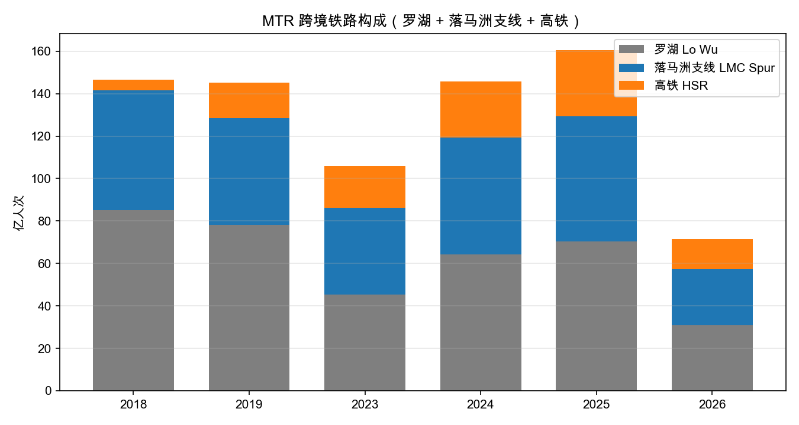
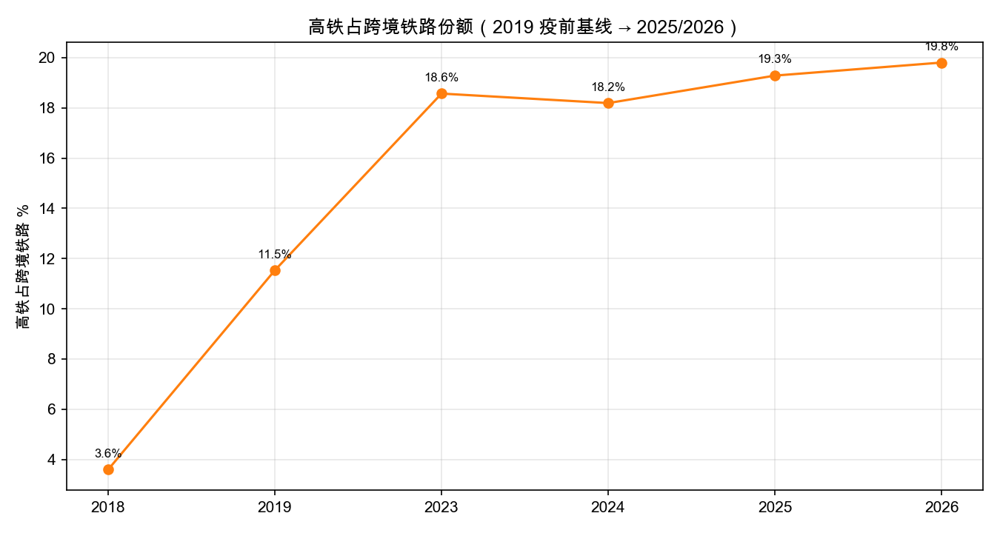
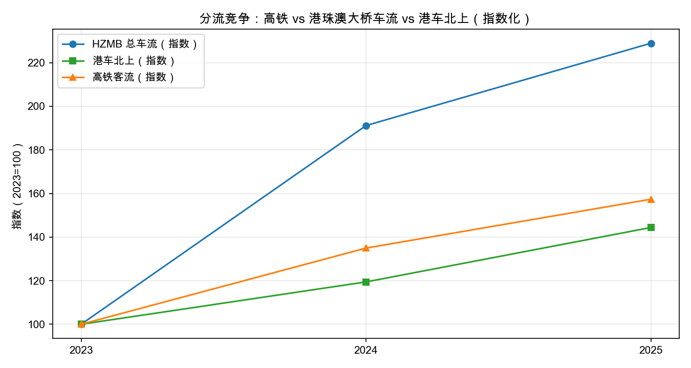

# MTR Thesis A 验证：跨境结构牛（Cross-Boundary Structural Bull）

**版本**: v1.0 | **日期**: 2026-08-09 | **分支**: `codex/mtr-ls-thesis`

> 本文件是对 `MTR_LONG_SHORT_THESIS.md` 第四节 **Thesis A** 的第一轮量化验证。
> 所有数字均来自本 repo 已验证的官方数据（TD 运输署 table81e/table82、ImmD
> 入境处日度、CSD、farebox 模型），可复算。

## 0. Thesis A 一句话

> **Street 把大湾区整合当成「疫情后正常化」，但实际上跨境强度高于疫前基线，
> 且增长集中在 MTR 高毛利的高铁环节。**

本验证回答三个问题：

1. 高铁/跨境流量是疫后「回到 2019」还是「超越 2019」？
2. 增量客流质量（yield/mix）是否在向 MTR 有利的方向移动？
3. 谁在分流（港车北上/大桥车流），分流量级是否构成对 thesis 的反驳？

## 1. 核心数据口径（先说清楚，避免误读）

TD 运输署 `table82`（跨境乘客，按口岸）与 `table81e`（港珠澳大桥车辆，按车种/方向）
是**官方月度全历史**数据（我们留了 raw 快照，覆盖 2013 至今），可比 2019 基线。

三个容易混淆的口径：

| 口径 | 含义 | 覆盖 |
|---|---|---|
| 罗湖 LWT | 东铁线跨境终点 | 月 |
| 落马洲支线 LMCSL | 东铁线落马洲支线 | 月 |
| 高铁 ERLWK | 西九龙高铁（2018-09 通车） | 月 |
| **MTR 跨境铁路** | 罗湖 + 落马洲支线 + 高铁 | 上三者之和 |
| 全口径跨境 | 所有口岸（含深圳湾/香园围/大桥/机场等） | 月 |

**注意**：normalized 的 ImmD 日度数据里 `mtr_cross_boundary_total` 我们核对过 2046/2046
行等于「罗湖 + 落马洲支线」**不含高铁**（之前文档里有歧义，这里正式订正）。
做高铁份额/收入占比时必须把高铁**加回去**（本文件全部这样做）。

另一个已验证的一致性：TD `express_rail_passengers`（高铁）与 ImmD 日度
`hsr_west_kowloon_total` **逐月 1:1 吻合**（2023+），因此 2019 高铁基线可以直接用 TD，
2026 高频用 ImmD 日度补。

## 2. 验证 1：高铁/跨境是「回到 2019」还是「超越 2019」？

### 2.1 高铁（最干净的信号）

| 年 | 高铁西九龙（万人次） | vs 2019 | 备注 |
|---|---:|---:|---|
| 2018 | 527 | — | 2018-09 才通车 |
| **2019** | **1,673** | **基线 100** | 首个完整年 |
| 2020 | 98 | 6% | 疫情 |
| 2023 | 1,965 | +17% | 通关恢复首年 |
| 2024 | 2,652 | +59% | |
| 2025 | 3,093 | **+85%** | |
| 2026 YTD（至 08-08） | 2,032 | 8 个月已 = 2019 全年 1.21 倍 | 日均 9.24 万 = 2019 日均 2.0 倍 |

**高铁 2025 比 2019 高 +85%（日均 8.47 万 = 2019 的 1.85 倍），
2026 日均 9.24 万 = 2019 的 2.0 倍，且仅前 8 个月累计已达 2019 全年的 1.21 倍**——
这**不是**「回到 2019」，是实打实的结构性上移。

### 2.2 全口径跨境 vs MTR 铁路

| 年 | 全口径跨境（亿人次） | MTR 跨境铁路（亿人次） | 高铁占铁路 % |
|---|---:|---:|---:|
| 2018 | 3.15 | 1.47 | 3.6 |
| **2019** | **3.01** | **1.45** | **11.5** |
| 2020 | 0.24 | 0.10 | 9.8 |
| 2023 | 2.12 | 1.06 | 18.6 |
| 2024 | 2.98 | 1.46 | 18.2 |
| 2025 | **3.35** | 1.60 | **19.3** |
| 2026 YTD | — | — | 19.8 |

关键读数：

- 全口径跨境 2025 = 3.35 亿，**vs 2019 的 3.01 亿 = +11%**——总量已超越疫前。
- **MTR 跨境铁路 2025 = 1.60 亿 > 2019 的 1.45 亿**（+10%），而同期罗湖(-10%)/落马洲支线(+18%)
  内部此消彼长。高铁把整个 MTR 跨境盘子扛成了正增长。
- 高铁占铁路份额从 2019 的 11.5% → 2025 的 19.3%（2026 YTD 19.8%）。





## 3. 验证 2：增量客流质量是否对 MTR 有利？（yield / mix）

farebox 模型里高铁与普通跨境是分开算的：

| 年 | 高铁收入 HK$m | 跨境分部收入 HK$m | 高铁收入/跨境分部 | 高铁单客 yield | 跨境单客 yield |
|---|---:|---:|---:|---:|---:|
| 2019 | 2,113 | 3,644 | 58% | HK$124.9 | HK$35.0 |
| 2024 | 3,338 | 3,562 | 94% | HK$124.9 | HK$36.2 |
| 2025 | 3,883 | 3,862 | **101%** | HK$124.9 | HK$36.2 |

读法：

- **高铁单客 yield 是普通跨境的约 3.4 倍**（HK$125 vs HK$36）。同样一个人次，
  从罗湖/落马洲「搬到」高铁，MTR 单位收入质量提高 3 倍以上。
- FY2025 高铁收入（HK$3.88bn）**已超过整个普通跨境分部（HK$3.86bn）**——
  也就是「跨境分部」现在现金流几乎等于高铁单独一个贡献。
- 跨境每 1% 客流增长几乎全部打在高铁上 = high-yield mix 结构性利好。

## 4. 验证 3：分流风险（港车北上 / 大桥车流 vs 高铁）

「竞争视角」：高铁不是孤立垄断，港车北上、港珠澳大桥、跨境巴士都会分流。
我们用 TD 官方数据把三类增长指数化（2023=100）：

| 年 | HZMB 总车流（万架次/年） | 港车北上（港私家车北上，万架次） | 高铁客流（指数） | HZMB 总车流（指数） | 港车北上（指数） | 高铁（指数） |
|---|---:|---:|---:|---:|---:|---:|
| 2022 | 22 | 10.5 | — | — | — | — |
| 2023 | 228 | 12.8 | 100 | 100 | 100 | 100 |
| 2024 | 436 | 15.3 | 135 | 191 | 119 | 135 |
| 2025 | 522 | 18.5 | 157 | 229 | 144 | 157 |



读数（得分歧点）：

- **HZMB 总车流是三者里涨最快**（2023→2025 ×2.3）——但这主要是货车+跨境巴士增长，
  不全是客运分流。
- **港车北上增速反而最慢**（指数 144），且绝对量级小（2025 年仅 18.5 万架次 vs
  高铁 3,093 万人次的量级差 160 倍）。**从量级看，港车北上到目前远不足以吃掉高铁的增长。**
- 高铁指数 157 高于港车北上 144——高铁在「与私家车的竞争」里暂时还占上风。

**综合判断**：分流真实存在（尤其大桥车流），但**量级上远未威胁高铁**。Thesis A 的
核心命题（跨境结构上行 + 高铁 high-yield 主导）**没有被分流数据推翻**。

## 5. 结论：Thesis A 初步 PASS（方向正确，需持续监控）

1. **量**：高铁 2025 vs 2019 = +85%，全口径跨境 +11%，MTR 跨境铁路 +10%——**超越疫前**。
2. **质**：高铁 yied 3.4x 普通跨境；高铁收入已是整个跨境分部。**mix 持续向 high-yield 移动。**
3. **竞争**：分流存在但量级小，暂不构成对 thesis 的反驳。

因此 Thesis A（跨境结构牛）**得到存量官方数据的初步支持**。

## 6. 局限与后续

- 2026 TD 只到 2026-05（高铁 1,414 万），HSR 日度 run-rate 用 ImmD 日度补
  （至 08-08 累计 2,032 万、日均 9.24 万）。
- 高铁票务收入中「内地段/跨境合作分成」结构未拆（港铁的收入含给政府经营费，
  见 `MTR_LONG_SHORT_THESIS.md` 5.1）。这是下一步要核实的收入质量变量。
- 港车北上若要作为分流压力线，需要把**获牌配额/口岸能力**一起看（现在只有车流）。
- 建议在 **2026-08-13 MTR 中报**后，把 H1 官方披露的高铁/跨境收入回填进来校准
  farebox 的 mix 权重。

## 7. 复算方法

`scripts/mtr_thesis_a_cross_boundary.py` 输出全部指标与图表：

```bash
python3 scripts/mtr_thesis_a_cross_boundary.py
# => outputs/mtr_thesis_a_cross_boundary/
#    cross_boundary_annual.csv / hzmb_vehicles_annual.csv /
#    farebox_mix_annual.csv / immd_2026_runrate.csv / mtr_thesis_a_summary.md / charts/
```

数据来源：

- TD table82 跨境乘客（raw: `td_cross_boundary_passengers_*.csv`）
- TD table81e 港珠澳车辆（raw: `td_hzmb_vehicular_traffic_*.csv`）
- ImmD 日度（`data/normalized/hk_population_migration/immd_daily_traffic/`）
- farebox 模型（`data/processed/transport/mtr_farebox_revenue_monthly.csv`）

---
*研究备忘，非投资建议。个人判断部分（读数/结论）与已验证数据部分已明确分开。*
