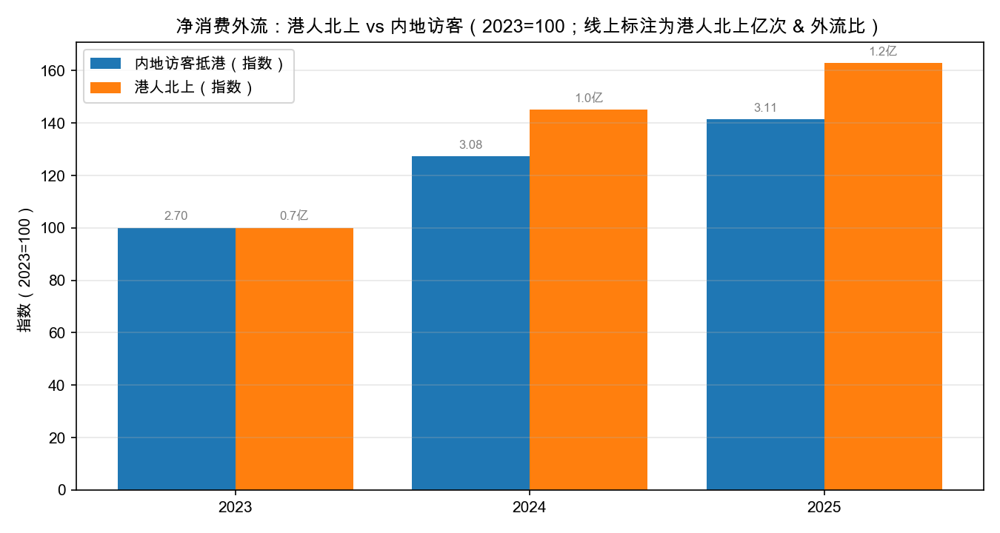
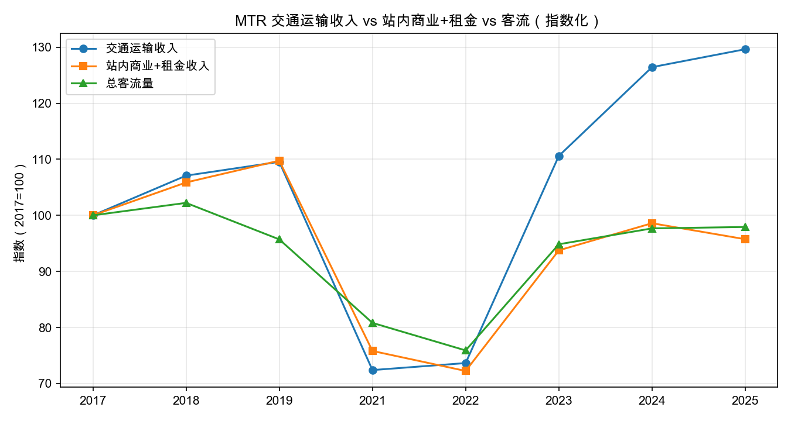
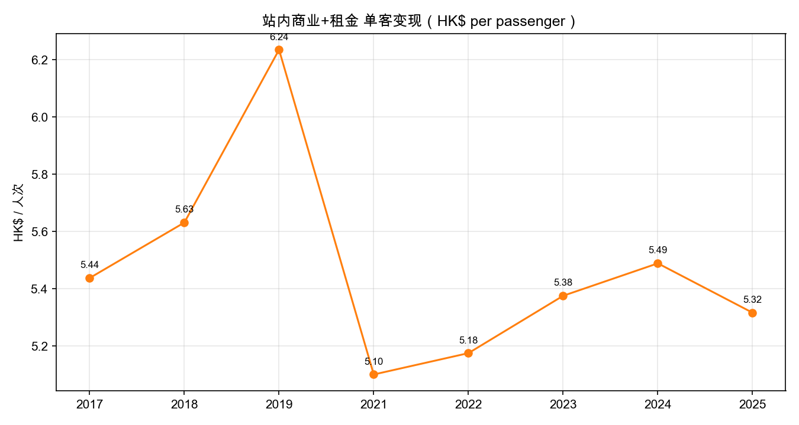

# MTR Thesis B 验证：收入结构质量（transport 增长，商业跟不跟得上）

**版本**: v1.0 | **日期**: 2026-08-10 | **分支**: `codex/mtr-ls-thesis`

> 本文件是对 `MTR_LONG_SHORT_THESIS.md` 第四节 **Thesis B** 的量化验证。
> 全部数字来自本 repo 已验证数据（MTR 官方财报 earnings bridge、MTR 月度客流、
> ImmD 日度、CSD），可复算。

## 0. Thesis B 一句话

> **客流在恢复，但「增量旅客单价低 + 港人北上消费外流」导致站内商业/租金收入
> 跟不上 transport 收入。即使 transport 增长 OK，commercial + rental 仍跑输
> —— 这是 FY27+ 盈利 mix 风险。**

## 1. 验证 1：净消费外流（ImmD 日度）

| 年 | 内地访客抵港（万人） | 港人北上出境（万人） | 外流比（北上/访客） | 净差（万） |
|---|---:|---:|---:|---:|
| 2023 | 2,674 | 7,221 | **2.70** | −4,547 |
| 2024 | 3,403 | 10,471 | **3.08** | −7,068 |
| 2025 | 3,782 | 11,755 | **3.11** | −7,973 |
| 2026 YTD | 2,541 | 7,482 | 2.94 | −4,941 |

读数：

- 每 1 名内地访客抵港，约 **3.1 名港人北上出境**——且比例从 2023 的 2.7 一路升到
  **3.1**，净消费外流在**扩大**（2025 净差约 7,973 万人次/年）。
- 这些北上的港人不在本地商场/车站商业消费，是车站商业持续跑输的直接宏观背景。



## 2. 验证 2：transport 收入 vs 站内商业+租金 vs 客流（剪刀差）

| 年 | transport 收入指数 | 站内商业+租金指数 | 客流指数 | 单客 transport | 单客商业+租金 |
|---|---:|---:|---:|---:|---:|
| 2017 | 100 | 100 | 100 | HK$9.10 | HK$5.44 |
| 2018 | 107 | 106 | 102 | 9.53 | 5.63 |
| 2019 | 110 | 110 | 96 | 10.42 | 6.24 |
| 2021 | 72 | 76 | 81 | 8.15 | 5.10 |
| 2022 | 74 | 72 | 76 | 8.83 | 5.18 |
| 2023 | 111 | 94 | 95 | 10.61 | 5.38 |
| 2024 | 126 | 99 | 98 | 11.78 | 5.49 |
| 2025 | **130** | **96** | **98** | **12.05** | **5.32** |





**这是 Thesis B 最有力的证据（2017 = 100）：**

1. **transport 收入指数 130** vs **客流指数 98**——transport 恢复远超客流，因为高铁
   high-yield mix 拉高了单客变现（HK$9.10 → HK$12.05，**+32%**）。这印证了 Thesis A。
2. **站内商业+租金指数只有 96**，不仅没跟上 transport（130），甚至**低于疫情前基线的 100**，
   也低于客流（98）——单客商业变现从 2019 峰值 6.24 持续回落到 5.32（**较 2017 −2%**）。
3. 结论：**transport 与商业的剪刀差在 2024-2025 明显拉大**——2024→2025
   transport 收入 +2.5%，站内商业+租金 **−2.9%**。

## 3. 验证 3：谁的锅？—— 拉低的是「租金」，不是「站内商业」

| 细项 | 2024 | 2025 | YoY |
|---|---:|---:|---:|
| 站内商业（kiosk/广告/电信等） | HK$5,343m | HK$5,345m | **+0.04%** |
| 物业租金及管理 | HK$5,379m | HK$5,067m | **−5.8%** |
| transport 收入 | HK$23,013m | HK$23,595m | +2.5% |

- **站内商业本身几乎零增长**（+0.04%），KPI 层面就是「有人流但没变现」。
- **租金 −5.8%** 是 2024→2025 商业端回落的主要来源，对应 MTR 在年报中披露的
  **商场/商铺租金 reversion 转负**（kiosk −9.8%、商场 −8.9%，2024 年报）。
- 这与 Thesis A 的发现完全自洽：**transport 靠高铁 mix 涨价，商业端没这个引擎**，
  反而承受港人北上消费外流的直接冲击。

## 4. 结论：Thesis B 得到强支持（且找到了精确的传导渠道）

1. **净消费外流真实且在扩大**（外流比 2.7 → 3.1）。
2. **剪刀差铁证**：transport 收入指数 130 vs 商业 96 vs 客流 98（2017=100）。
3. **单客变现分化**：transport 每客流 HK$12.05（+32% vs 2017），商业每客流
   HK$5.32（−2%）——MTR 从「每客流赚的钱」越来越偏 transport、越来越不偏商业。
4. **精确传导**：2025 的拖累来自**租金 −5.8%**（reversion 转负），站内商业零增长。

**对交易的含义**：Thesis B 不是「transport 变差」，而是「transport 靠高铁 mix 支撑、
商业端（尤其 rental）持续跑输」——盈利结构从「高毛利商业/租金」向「受监管、高固定成本
的 transport」倾斜。这解释了为什么 transport 客流/收入持续新高但整体盈利质量没有同比例
改善（FY2025 recurrent post-tax 5,653 仍低于 FY2024 的 7,210）。

## 5. 局限与后续

- 2017-2019 站内商业/租金为合并披露口径，2020+ 为两列相加，可比但粒度稍粗。
- 车站商业收入含 kiosk/广告/电信等混合科目，无法单独拆出「零售 reversion」——
  若想更深，需要 MTR 中报披露的细分（如商场租金 reversion 明细）。
- ImmD 日度 2021 起，缺 2019 疫前同口径日度对比（年度总量可用 CSD/TD）。
- **建议 8/13 中报后**回填 H1 商业+租金实际数，看 2026 年租金 reversion 是否继续转负
  （若 cap rate 压缩 + 零售回暖，租金端可能修复——那是 Thesis B 的潜在反转点）。

## 6. 复算方法

```bash
python3 scripts/mtr_thesis_b_commercial_mix.py
# => outputs/mtr_thesis_b_commercial_mix/
#    immd_flow_yearly.csv / commercial_yearly.csv / mtr_thesis_b_summary.md
# + docs/asia-markets/charts/thesis_b_*.png
```

数据来源：

- MTR 官方财报 bridge（`data/normalized/hk_transport/mtr_historical_earnings_bridge.csv`）
- MTR 月度客流（`data/raw/hk_transport/mtr_patronage_*.json`）
- ImmD 日度（`data/normalized/hk_population_migration/immd_daily_traffic/`）

---
*研究备忘，非投资建议。个人判断（读数/结论）与已验证数据部分已明确分开。
*
