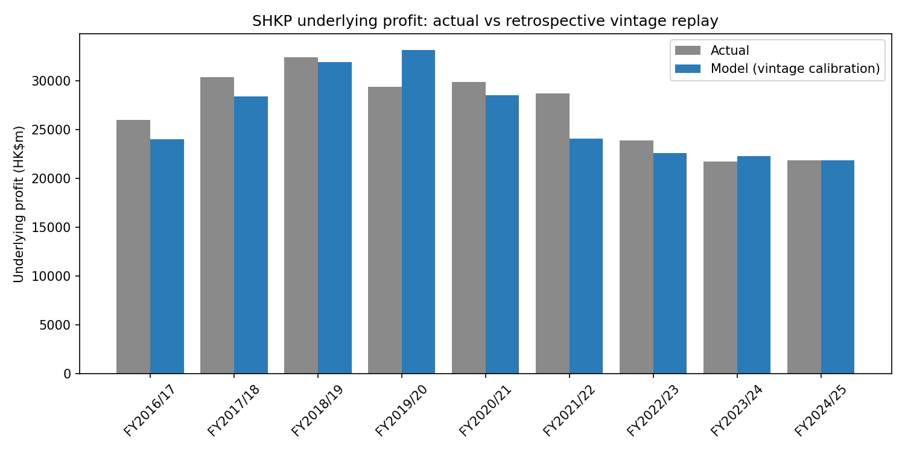
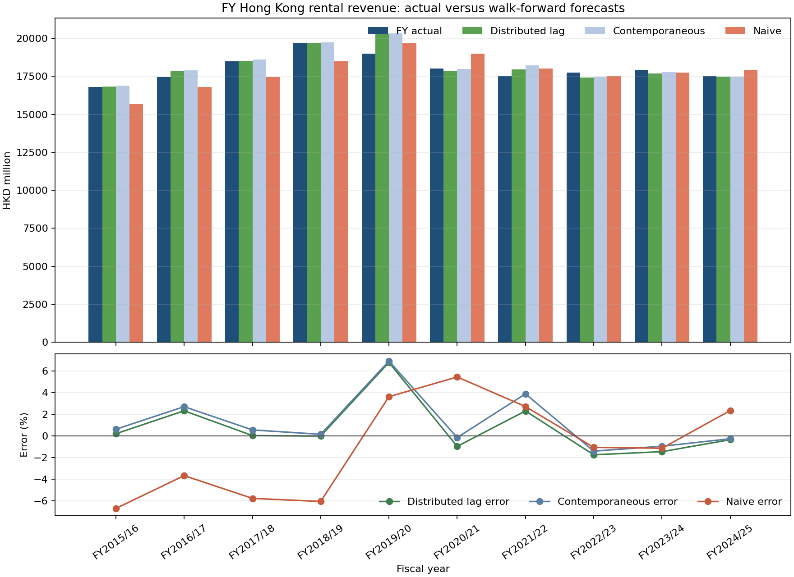

# SHKP Full Backtest: FY and H1 Predictions versus Actuals

## Scope

This report puts the major SHKP prediction-versus-actual layers on one page.
They are kept as separate targets: FY underlying profit, FY Hong Kong rental
revenue, H1-to-FY group revenue recognition, and the experimental H2 component
bridge. Error is forecast / actual − 1; positive means over-forecast.

## Headline comparison

| Layer | Valid periods | Method | Mean APE | Notes |
|---|---:|---|---:|---|
| FY underlying profit | 9 | Vintage margin replay | 6.37% | Retrospective research replay; not strict PIT/OOS |
| FY HK rental revenue | 10 | Distributed lag | 1.62% | Walk-forward OOS; scenario-grade elasticities |
| H1 group revenue | 8 | 2×H1 | 14.24% | Recognition baseline |
| H1 reported profit | 8 | 2×H1 | 22.52% | More volatile than revenue |
| H1 HK property sales | 7 | 2×H1 | 37.30% | Handover-driven, lumpy |
| H1 component bridge | 7 | Component H2 | 28.51% | Experimental; currently worse than 2×H1 |

## FY whole-company underlying profit

| FY | Actual | Model | Error | EPS actual | EPS model | EPS error |
|---|---:|---:|---:|---:|---:|---:|
| FY2016/17 | 25,965 | 23,979 | -7.6% | 8.97 | 8.28 | -0.69 |
| FY2017/18 | 30,398 | 28,411 | -6.5% | 10.49 | 9.81 | -0.68 |
| FY2018/19 | 32,398 | 31,936 | -1.4% | 11.18 | 11.03 | -0.15 |
| FY2019/20 | 29,368 | 33,161 | +12.9% | 10.13 | 11.45 | +1.32 |
| FY2020/21 | 29,873 | 28,513 | -4.6% | 10.31 | 9.85 | -0.46 |
| FY2021/22 | 28,729 | 24,093 | -16.1% | 9.91 | 8.32 | -1.59 |
| FY2022/23 | 23,885 | 22,590 | -5.4% | 8.24 | 7.80 | -0.44 |
| FY2023/24 | 21,739 | 22,306 | +2.6% | 7.50 | 7.70 | +0.20 |
| FY2024/25 | 21,855 | 21,866 | +0.1% | 7.54 | 7.55 | +0.01 |



The vintage replay has a 6.37% mean absolute error, but it uses retrospective
margin calibration and a current ownership snapshot. Treat it as a portability
diagnostic, not a clean historical trading forecast.

## FY Hong Kong rental revenue

| FY | Actual | Distributed lag | Contemporaneous | Naive |
|---|---:|---:|---:|---:|
| FY2015/16 | 16,800 | 16,834 (+0.2%) | 16,904 (+0.6%) | 15,675 (+6.7%) |
| FY2016/17 | 17,439 | 17,844 (+2.3%) | 17,911 (+2.7%) | 16,800 (+3.7%) |
| FY2017/18 | 18,506 | 18,512 (+0.0%) | 18,609 (+0.6%) | 17,439 (+5.8%) |
| FY2018/19 | 19,698 | 19,696 (+0.0%) | 19,728 (+0.2%) | 18,506 (+6.1%) |
| FY2019/20 | 19,009 | 20,299 (+6.8%) | 20,324 (+6.9%) | 19,698 (+3.6%) |
| FY2020/21 | 18,027 | 17,853 (+1.0%) | 18,000 (+0.1%) | 19,009 (+5.4%) |
| FY2021/22 | 17,551 | 17,956 (+2.3%) | 18,233 (+3.9%) | 18,027 (+2.7%) |
| FY2022/23 | 17,738 | 17,429 (+1.7%) | 17,489 (+1.4%) | 17,551 (+1.1%) |
| FY2023/24 | 17,942 | 17,681 (+1.5%) | 17,771 (+1.0%) | 17,738 (+1.1%) |
| FY2024/25 | 17,531 | 17,470 (+0.3%) | 17,485 (+0.3%) | 17,942 (+2.3%) |

| Method | Periods | Mean APE | MAE (HKD m) | Mean signed error (HKD m) |
|---|---:|---:|---:|---:|
| contemporaneous | 10 | 1.76% | 320 | +221 |
| distributed_lag | 10 | 1.62% | 295 | +133 |
| naive_flat | 10 | 3.85% | 697 | -186 |



## H1-to-FY recognition backtest

`2×H1` annualises the current interim actual. `Prior-share` divides H1 by the
median H1/FY share from strictly earlier years. Neither is a complete earnings
model; they are recognition baselines.

| FY | Metric | H1 actual | FY actual | 2×H1 (error) | Prior-share (error) | Status |
|---|---|---:|---:|---:|---:|---|
| FY2016/17 | group_revenue | 46,343 | 67,877 | 92,686 (+36.5%) | — (—) | annualization_only_insufficient_training |
| FY2017/18 | group_revenue | 55,166 | 72,206 | 110,332 (+52.8%) | 80,800 (+11.9%) | valid_prior_share_holdout |
| FY2018/19 | group_revenue | 37,112 | 75,037 | 74,224 (-1.1%) | 51,304 (-31.6%) | valid_prior_share_holdout |
| FY2019/20 | group_revenue | 38,711 | 75,499 | 77,422 (+2.5%) | 56,699 (-24.9%) | valid_prior_share_holdout |
| FY2020/21 | group_revenue | 46,070 | 85,262 | 92,140 (+8.1%) | 89,851 (+5.4%) | valid_prior_share_holdout |
| FY2021/22 | group_revenue | 40,153 | 77,747 | 80,306 (+3.3%) | 78,311 (+0.7%) | valid_prior_share_holdout |
| FY2022/23 | group_revenue | 27,428 | 71,195 | 54,856 (-22.9%) | 53,108 (-25.4%) | valid_prior_share_holdout |
| FY2023/24 | group_revenue | 27,542 | 71,506 | 55,084 (-23.0%) | 53,329 (-25.4%) | valid_prior_share_holdout |
| FY2024/25 | group_revenue | 39,933 | 79,721 | 79,866 (+0.2%) | 103,654 (+30.0%) | valid_prior_share_holdout |
| FY2017/18 | hk_property_sales_revenue | 31,761 | 35,725 | 63,522 (+77.8%) | — (—) | annualization_only_insufficient_training |
| FY2018/19 | hk_property_sales_revenue | 12,119 | 36,541 | 24,238 (-33.7%) | 13,632 (-62.7%) | valid_prior_share_holdout |
| FY2019/20 | hk_property_sales_revenue | 14,678 | 36,873 | 29,356 (-20.4%) | 24,049 (-34.8%) | valid_prior_share_holdout |
| FY2020/21 | hk_property_sales_revenue | 23,433 | 34,880 | 46,866 (+34.4%) | 58,867 (+68.8%) | valid_prior_share_holdout |
| FY2021/22 | hk_property_sales_revenue | 16,997 | 32,878 | 33,994 (+3.4%) | 42,699 (+29.9%) | valid_prior_share_holdout |
| FY2022/23 | hk_property_sales_revenue | 2,885 | 23,866 | 5,770 (-75.8%) | 5,581 (-76.6%) | valid_prior_share_holdout |
| FY2023/24 | hk_property_sales_revenue | 3,612 | 24,745 | 7,224 (-70.8%) | 6,987 (-71.8%) | valid_prior_share_holdout |
| FY2024/25 | hk_property_sales_revenue | 16,031 | 26,139 | 32,062 (+22.7%) | 109,825 (+320.2%) | valid_prior_share_holdout |
| FY2016/17 | reported_profit_attributable | 20,659 | 36,263 | 41,318 (+13.9%) | — (—) | annualization_only_insufficient_training |
| FY2017/18 | reported_profit_attributable | 33,031 | 42,114 | 66,062 (+56.9%) | 57,980 (+37.7%) | valid_prior_share_holdout |
| FY2018/19 | reported_profit_attributable | 20,469 | 39,507 | 40,938 (+3.6%) | 30,234 (-23.5%) | valid_prior_share_holdout |
| FY2019/20 | reported_profit_attributable | 15,419 | 21,485 | 30,838 (+43.5%) | 27,065 (+26.0%) | valid_prior_share_holdout |
| FY2020/21 | reported_profit_attributable | 13,578 | 26,686 | 27,156 (+1.8%) | 18,920 (-29.1%) | valid_prior_share_holdout |
| FY2021/22 | reported_profit_attributable | 15,186 | 25,560 | 30,372 (+18.8%) | 29,311 (+14.7%) | valid_prior_share_holdout |
| FY2022/23 | reported_profit_attributable | 8,410 | 23,907 | 16,820 (-29.6%) | 14,155 (-40.8%) | valid_prior_share_holdout |
| FY2023/24 | reported_profit_attributable | 9,145 | 19,046 | 18,290 (-4.0%) | 17,973 (-5.6%) | valid_prior_share_holdout |
| FY2024/25 | reported_profit_attributable | 7,523 | 19,277 | 15,046 (-21.9%) | 15,668 (-18.7%) | valid_prior_share_holdout |


## Component H2 bridge

```text
FY group revenue = H1 actual + H2 HK development + H2 HK rental + H2 hotel + H2 residual
```

| FY | FY actual | Component forecast | Error | Training years | Status |
|---|---:|---:|---:|---|---|
| FY2016/17 | 67,877 | — | — | — | insufficient_component_coverage |
| FY2017/18 | 72,206 | — | — | 2017 | insufficient_component_coverage |
| FY2018/19 | 75,037 | 52,607 | -29.9% | 2017,2018 | valid_holdout |
| FY2019/20 | 75,499 | 67,733 | -10.3% | 2017,2018,2019 | valid_holdout |
| FY2020/21 | 85,262 | 93,254 | +9.4% | 2018,2019,2020 | valid_holdout |
| FY2021/22 | 77,747 | 80,952 | +4.1% | 2019,2020,2021 | valid_holdout |
| FY2022/23 | 71,195 | 53,123 | -25.4% | 2020,2021,2022 | valid_holdout |
| FY2023/24 | 71,506 | 54,227 | -24.2% | 2021,2022,2023 | valid_holdout |
| FY2024/25 | 79,721 | 156,523 | +96.3% | 2022,2023,2024 | valid_holdout |
| FY2025/26 | — | 121,174 | — | 2023,2024,2025 | valid_current_h1_only |


The component bridge is intentionally retained even though its current mean
APE is about 28.5%. The FY2024/25 overshoot demonstrates that historical
component H2/H1 ratios are not stationary when handover timing changes. The
next upgrade should use PIT project completion/recognition schedules, not
window-tuning after observing the FY result.

## Data-quality and PIT notes

- The latest H1 run has 149 parsed facts across 10 official interim PDFs.
- H1 training years are strictly earlier than each target; no future-year
  training leakage was detected.
- FY2017–FY2020 consolidated annual fallback rows remain non-PIT because the
  original announcement dates are unavailable.
- FY2025/26 H1 has a current component forecast but no FY actual, so it is not
  scored.
- Consensus and broker snapshots are not included as historical forecasts;
  the repository still lacks a complete announcement-vintage consensus tape.

Source reports:

- [SHKP H1 backtest report](SHKP_H1_BACKTEST_REPORT.md)
- [SHKP skeleton backtest v2](SHKP_SKELETON_BACKTEST_V2_REPORT.md)
