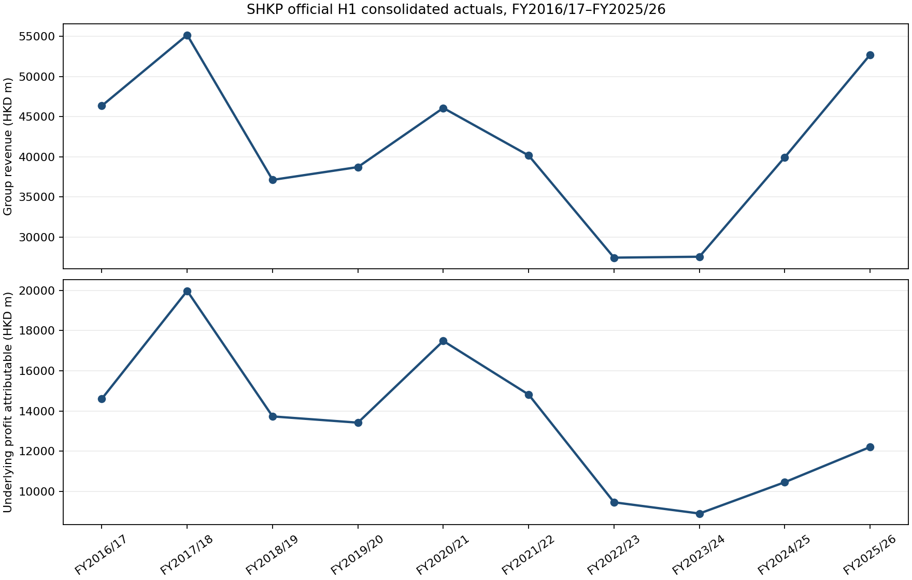
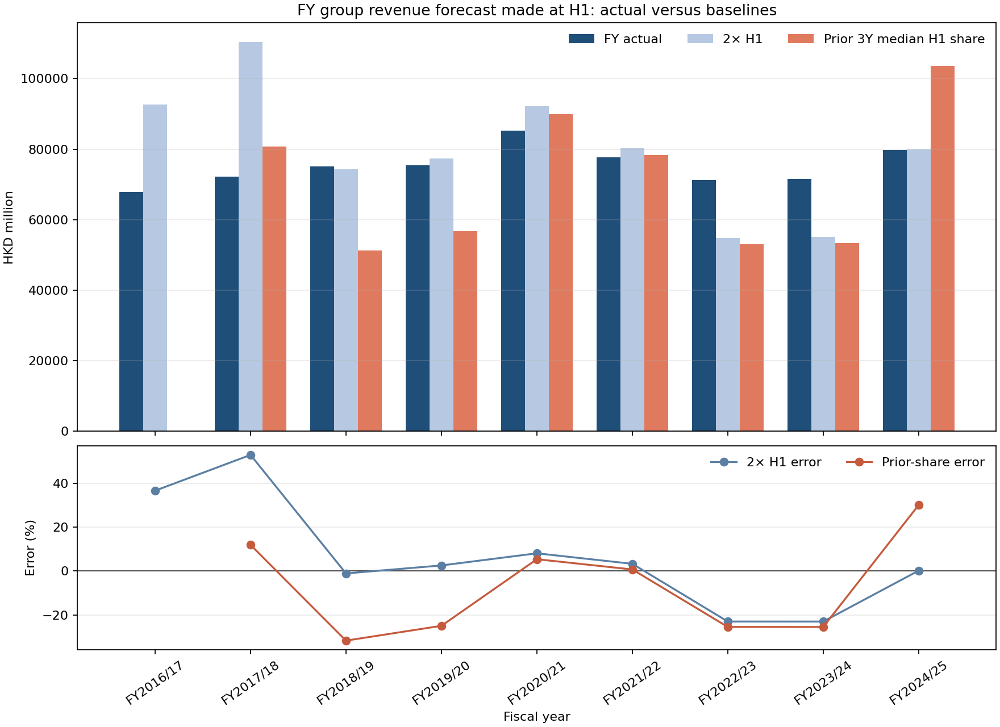
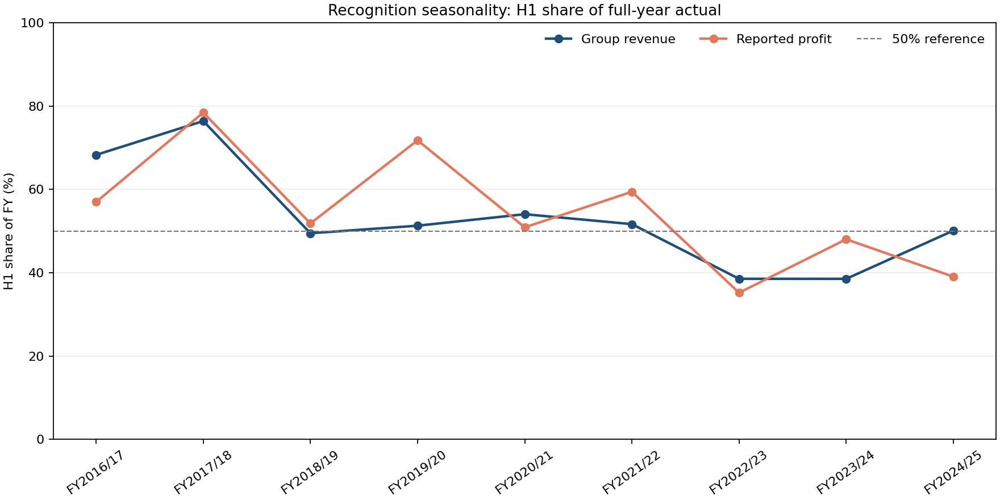
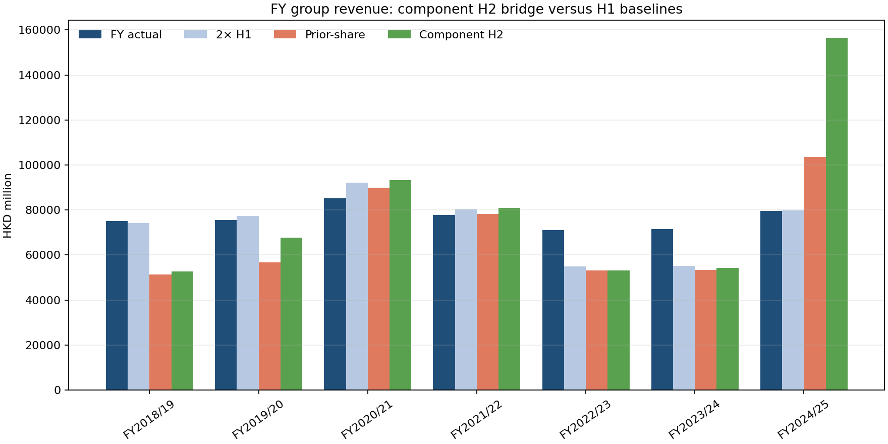
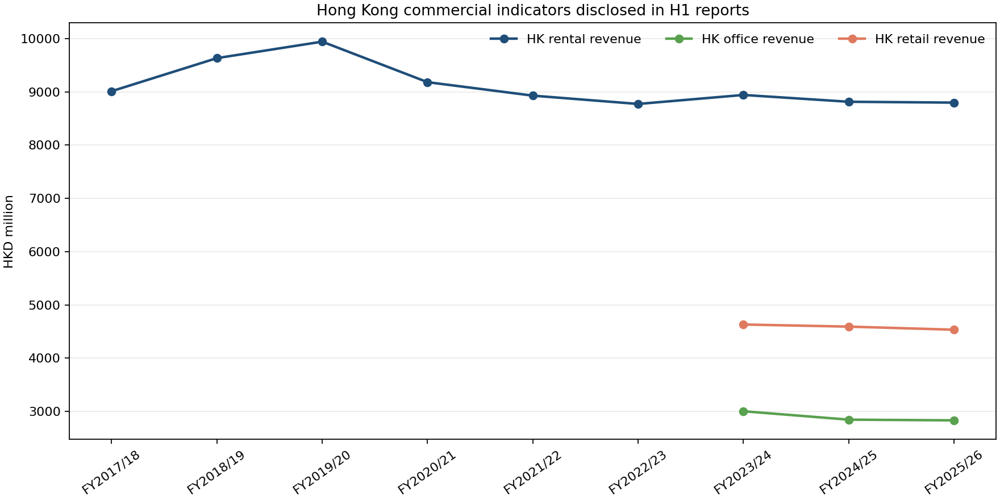

# SHKP H1 Actual Panel and Recognition Backtest

## Technical summary

- The official issuer catalogue now covers **10 interim reports from FY2016/17 through FY2025/26**. All 10 PDFs fetched successfully and all panel rows carry the report release date as the earliest availability date.
- The H1 actual panel contains **149 fact rows**. The core consolidated metrics (revenue, reported/underlying profit, gross/net rental income, EPS and interim dividend) have one observation in every report year.
- In FY2025/26 H1, SHKP reported group revenue of **HKD 52,705m**, underlying profit attributable of **HKD 12,213m**, Hong Kong rental revenue of **HKD 8,797m**, office revenue of **HKD 2,834m**, and retail revenue of **HKD 4,535m**.
- The expanding holdout is useful as a recognition diagnostic, not a finished earnings forecast. For group revenue, the simple 2×H1 baseline has mean APE **14.2%** across 8 valid holdouts; the prior-three-year median H1-share baseline is **19.4%**. The difference is not stable enough to justify a complex model yet.

## Key findings: recognition seasonality is the main H1 risk

    The H1-to-FY bridge shows that SHKP's group revenue H1 share ranged from roughly 39% to 76% in the available history. Hong Kong property-sales recognition is much more seasonal and lumpy: the corrected segment-table history ranges from roughly 12% to 89% across the available FY2017/18–FY2024/25 observations. A half-year run-rate should therefore be treated as a scenario, not a point forecast.





## H1-to-FY recognition bridge

The following table is the arithmetic bridge for consolidated group revenue. H2 is calculated as FY actual minus H1 actual; it is not a separately filed observation.

| Fiscal year | H1 actual (HKD m) | H2 arithmetic (HKD m) | FY actual (HKD m) | H1 share | Annual source quality |
|---|---:|---:|---:|---:|---|
| FY2016/17 | 46,343 | 21,534 | 67,877 | 68.3% | fallback non-PIT |
| FY2017/18 | 55,166 | 17,040 | 72,206 | 76.4% | fallback non-PIT |
| FY2018/19 | 37,112 | 37,925 | 75,037 | 49.5% | fallback non-PIT |
| FY2019/20 | 38,711 | 36,788 | 75,499 | 51.3% | fallback non-PIT |
| FY2020/21 | 46,070 | 39,192 | 85,262 | 54.0% | official |
| FY2021/22 | 40,153 | 37,594 | 77,747 | 51.6% | official |
| FY2022/23 | 27,428 | 43,767 | 71,195 | 38.5% | official |
| FY2023/24 | 27,542 | 43,964 | 71,506 | 38.5% | official |
| FY2024/25 | 39,933 | 39,788 | 79,721 | 50.1% | official |



## H1 actual-vs-nowcast results

The backtest compares two pre-FY baselines: (1) annualise H1 by multiplying by two; and (2) divide H1 by the median H1/FY share from up to the prior three fiscal years. Training years are stored per row and are strictly earlier than the target year.

| Metric | Valid holdouts | Mean APE: 2× H1 | Mean APE: prior-share median |
|---|---:|---:|---:|
| Group revenue | 8 | 14.2% | 19.4% |
| Reported profit | 8 | 22.5% | 24.5% |
| HK property-sales revenue | 7 | 37.3% | 95.0% |

The HK property-sales result is deliberately shown separately from consolidated revenue: its recognition timing is project-handover driven, so its errors are expected to be much larger and it should not be used as a stable recurring-income proxy.

## Component H2 revenue bridge

The next model keeps the same FY group-revenue target but forecasts the remaining half-year by component:

```text
FY group revenue = H1 actual + H2 HK development + H2 HK rental + H2 hotel + H2 residual
```

Each H2 component uses the median H2/H1 ratio from strictly earlier fiscal years. The residual is explicit and absorbs Mainland, telecom/infrastructure, other businesses and JV/scope differences. It is a rough recognition bridge, not a project-level handover forecast.

| Model | Valid holdouts | Mean APE | Median APE | Mean signed error |
|---|---:|---:|---:|---:|
| Component H2 bridge | 7 | 28.5% | 24.2% | 2.9% |

| Fiscal year | FY actual | Component forecast | Error | APE | Training years |
|---|---:|---:|---:|---:|---|
| FY2018/19 | 75,037 | 52,607 | -29.9% | 29.9% | 2017,2018 |
| FY2019/20 | 75,499 | 67,733 | -10.3% | 10.3% | 2017,2018,2019 |
| FY2020/21 | 85,262 | 93,254 | 9.4% | 9.4% | 2018,2019,2020 |
| FY2021/22 | 77,747 | 80,952 | 4.1% | 4.1% | 2019,2020,2021 |
| FY2022/23 | 71,195 | 53,123 | -25.4% | 25.4% | 2020,2021,2022 |
| FY2023/24 | 71,506 | 54,227 | -24.2% | 24.2% | 2021,2022,2023 |
| FY2024/25 | 79,721 | 156,523 | 96.3% | 96.3% | 2022,2023,2024 |
| FY2025/26 | n/a | 121,174 | n/a | n/a | 2023,2024,2025 |



The component bridge is retained as a diagnostic even when it loses to 2×H1. A large miss means the H2/FY recognition ratios are not stationary enough; it is not a reason to tune the window after seeing the target year.

## Hong Kong commercial observations

The official H1 reports provide a useful commercial series, but the disclosure grain changes over time. Hong Kong rental revenue is available for most years from the financial-review narrative; explicit office/retail revenue is consistently available only in the recent three reports. This is enough to anchor the current commercial module, not enough to claim a long clean office/retail panel.



## Scope, data and metric definitions

- **H1 period:** six months ended 31 December of each fiscal year. Values are HKD million unless labelled per share.
- **Availability/PIT:** `release_date` from the official interim report is used as `availability_date`; the H1 actual itself is not treated as available at 31 December.
- **Consolidated metrics:** taken from the report's financial-highlights table; rental metrics include joint ventures and associates where the report footnote says so.
- **Hong Kong commercial metrics:** taken from the financial-review narrative and retained only when an explicit HKD amount is printed beside the relevant Hong Kong/office/retail label.
- **Contracted sales:** preserved as contracted-sales flow or backlog and never renamed as revenue.
- **Annual actuals:** official curated annual summary/segment history is preferred. FY2017–FY2020 consolidated fallback values come from the sibling financial-data source and are explicitly labelled non-PIT because original announcement timestamps are not present.

## Method and validation

1. Fetch the official PDF URL in the report registry and save an immutable raw snapshot.
2. Extract PDF text with `pypdf`, apply narrow legacy text repairs, and parse only labelled current-period figures. Missing splits remain missing.
3. Build the recognition bridge by joining H1 to the aligned fiscal-year actual; compute H2 as an arithmetic residual.
4. For each target fiscal year, fit the prior-share baseline using only earlier complete bridge rows; store the training years and both model errors.

The current automated checks cover registry completeness, legacy footnote parsing, missing-split behavior, H2 arithmetic, and no-future-training-year leakage (`pytest -q tests/test_hk_real_estate_shkp_h1_backtest.py`).

## Limitations and uncertainty

- The FY2026 H1 row has no FY2026 actual yet, so it is a current H1 observation only and is excluded from holdout scoring.
- Consolidated FY2017–FY2020 annual fallback values are source-selected rather than strict announcement-vintage values. They are suitable for a rough recognition diagnostic, not a PIT earnings backtest claim.
- The H1 panel is issuer-reported and therefore includes accounting recognition timing, JV/associate scope and property handovers. It is not a direct proxy for project-level contract activity.
- Consensus/analyst estimates are not included here; this deliverable is an actuals and recognition-seasonality layer.

## Recommended next steps

- Pull official annual-report PDFs for FY2017–FY2020 and replace the consolidated fallback rows with primary annual-report facts and release dates.
- Extend the office/retail H1 split backwards only where the report prints a level; do not manufacture a split from a percentage change.
- Use the recognition-share distribution as a bounded H2 scenario input in the whole-company model, with a separate property-sales handover module.

## Further questions

- Can the annual-report segment notes provide a stable HK office/retail/residential-serviced-apartment split before FY2022/23?
- Which reported H1 commercial changes are explained by occupancy, rental reversion, new openings, or JV scope rather than market-rent indices?

Source registry and datasets:

- `data/normalized/hk_real_estate/shkp_h1_report_registry/`
- `data/normalized/hk_real_estate/shkp_h1_actual_panel/`
- `data/normalized/hk_real_estate/shkp_h1_to_fy_bridge/`
- `data/normalized/hk_real_estate/shkp_h1_actual_vs_nowcast/`
- `src/hk_real_estate/shkp_h1_backtest.py`
