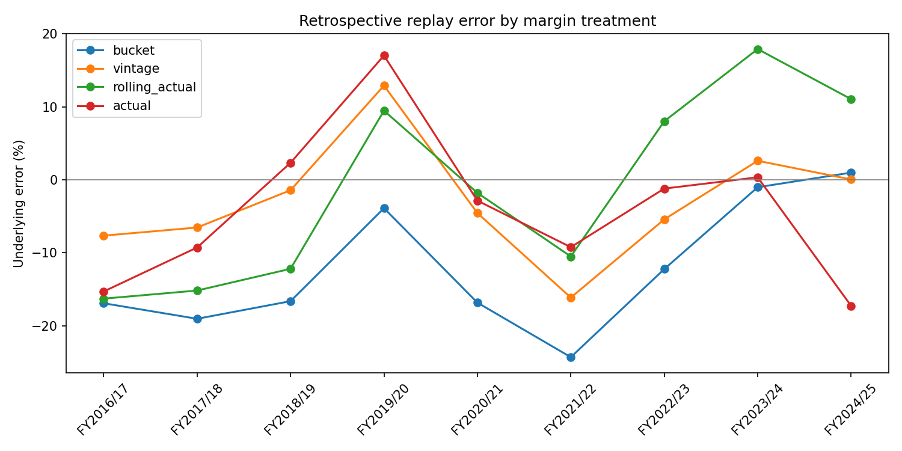
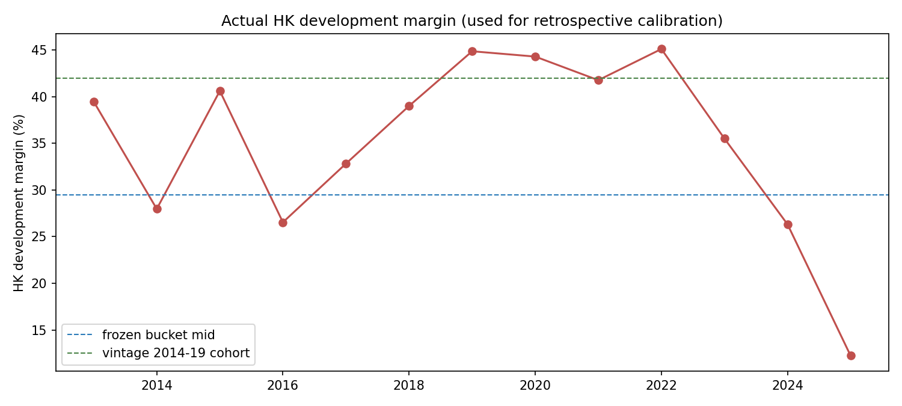

# SHKP Skeleton Historical Backtest v2 — vintage margin replay

## TL;DR

The historical replay (FY2017-FY2025, whole-company underlying profit) uses the
**launch-cohort ("vintage") margin calibration** as its default. Overall MAE
improves from **12.4% -> 6.4%** with no change to the frozen v1.0
forward engine — only the margin assumption used to replay history changes.
The legacy static bucket remains available as `margin_mode="bucket"`.

**Important scope:** this is a retrospective calibration/replay, not a strict
point-in-time (PIT) or out-of-sample (OOS) backtest. The vintage bands were
calibrated using the realised development-margin history, and the current
ownership snapshot is not reconstructed for every historical date. Treat the
MAE as a research diagnostic, not as a deployable historical forecast score.

## Why the old backtest under-estimated 2017-2022

The frozen margin bucket (22.5/29.5/37.5% by ASP) was calibrated to the
FY26/27 **low-margin** delivery mix, but actual HK development margins in
2017-2022 ran **32.8-45.1%**.  Overlaid on ~33-37bn of recognised revenue that
is a 10-15pp understatement per year - which is exactly the old -15% to -31%
backtest error.  It is **not** the mainland boom: mainland development profit
only spiked in FY2021 (6.4bn) and FY2025 (5.1bn), and in both years the
non-residential run-rate either captured it (FY2021: -135m error) or was
offset by residential (FY2025).

The replay assigns each phase a margin from its **`coverage_start` year** as a
land-cost-vintage proxy: low-land-cost 2014-2019 launches get ~42%, while
post-2021 high-cost cohorts get ~24%. This is useful for scenario analysis, but
it should not be described as PIT until ownership evidence, information dates,
and the calibration sample are rebuilt vintage by vintage.

## Full backtest table (vintage default)

| FY | Actual (m) | Model (m) | Error | EPS act | EPS model | EPS err |
|---|---:|---:|---:|---:|---:|---:|
| FY2016/17 | 25,965 | 23,979 | -7.65% | 8.97 | 8.28 | -0.69 |
| FY2017/18 | 30,398 | 28,411 | -6.54% | 10.49 | 9.81 | -0.68 |
| FY2018/19 | 32,398 | 31,936 | -1.43% | 11.18 | 11.03 | -0.15 |
| FY2019/20 | 29,368 | 33,161 | +12.91% | 10.13 | 11.45 | +1.32 |
| FY2020/21 | 29,873 | 28,513 | -4.55% | 10.31 | 9.85 | -0.46 |
| FY2021/22 | 28,729 | 24,093 | -16.14% | 9.91 | 8.32 | -1.59 |
| FY2022/23 | 23,885 | 22,590 | -5.42% | 8.24 | 7.80 | -0.44 |
| FY2023/24 | 21,739 | 22,306 | +2.61% | 7.50 | 7.70 | +0.20 |
| FY2024/25 | 21,855 | 21,866 | +0.05% | 7.54 | 7.55 | +0.01 |

MAE underlying = **6.37%**.

## Error attribution by margin treatment

| margin mode | MAE |
|---|---:|
| actual | 8.31% |
| bucket | 12.43% |
| rolling_actual | 11.38% |
| vintage | 6.37% |

## Residual error after the margin fix

* **FY2021/22 (-16.1%) and FY2019/20 (+12.9%)** - non-residential run-rate
  swings around the Mainland/rental cycle, not a margin or coverage issue.
* **FY2016/17 (-7.6%)** - SRPE went live in 2013, so pre-2013 launches have no
  first-hand registers on the platform (documented data floor, kernel 0.36).
* **FY2024/25 (+0.05%)** - converged. The next forward estimate should be
  treated as a scenario output until the coverage and information-date gates
  are complete.

## Charts

## Engineering gate

* `build_shkp_skeleton_backtest(..., margin_mode="vintage")` is the default
  research replay; `margin_mode="bucket"` reproduces the legacy behaviour.
* Shared phase-prep / vintage helpers extracted so the decomposition and the
  backtest cannot drift apart.
* The report should be regenerated after any historical transaction or
  ownership rebuild; the resulting score remains retrospective until a strict
  PIT/OOS data contract is implemented.
