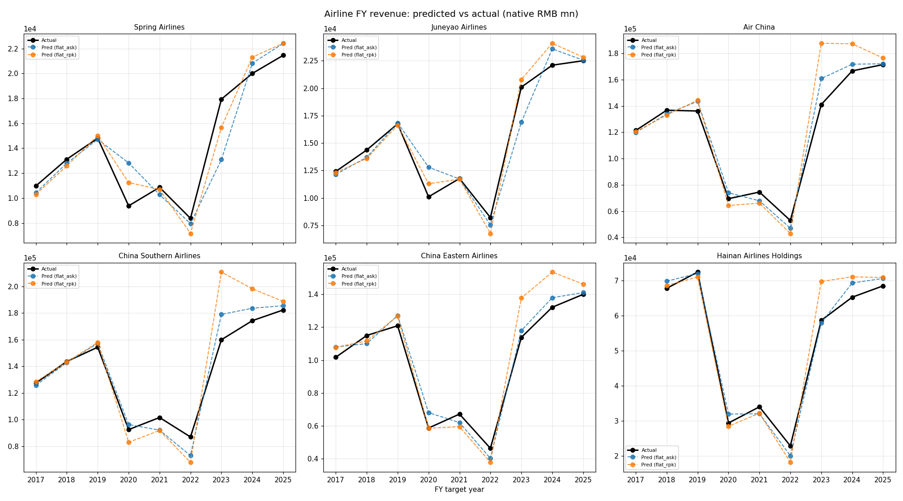
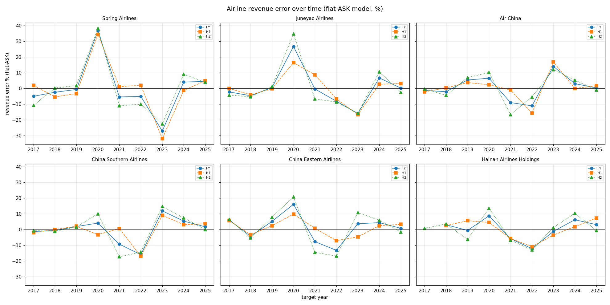
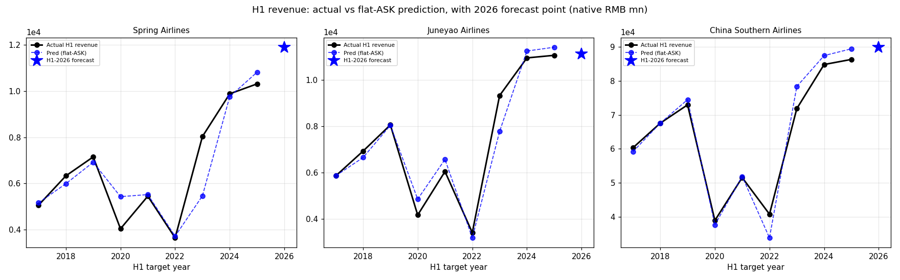
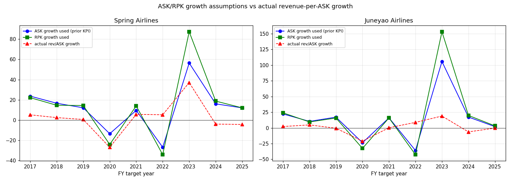

# Airline History Backtest: Predictions vs Actuals Over Time

Status: 2026-08-10.  This is the time-series view of the airline backtest:
for each carrier and each modelled KPI, what did the flat-yield model
predict for every period since 2017, and what actually happened?

## What the history looks like

The row-level backtest (`airline_period_kpi_backtest.csv`, 162 rows) and
the H1 backtest (`airline_h1_kpi_backtest.csv`, 60 rows) both store, per
company x period (H1/H2/FY) x target year (2017-2025, plus a 2026 forecast
row in the H1 file):

- **Inputs actually used at the time**: prior ASK/RPK/load-factor (the
  "prior KPI"), and the derived ASK/RPK growth assumptions
- **Model output**: flat-ASK revenue, flat-RPK revenue, cost, and the
  residual profit bridge
- **Actuals**: target revenue / cost / attributable profit from the
  official financial history layer
- **Error**: revenue error %, cost error %, profit direction correct?

## Charts

### FY revenue: predicted vs actual (all six carriers, 2017-2025)

Reading: pre-2020 the flat-ASK line tracks actuals within a few percent;
2020 (COVID collapse) and 2023 (reopening surge) are the two regime years
where flat-yield extrapolation fails hardest - actuals fall ~30-40% in
2020 and jump ~80-100% in 2023 while the model only moves ~15-25%.

### Revenue error over time by period (flat-ASK, %)

- Errors are small (-5% to +5%) in normal years 2017-2019, 2021, 2024-2025
- 2020: +27% to +38% across carriers (model missed the COVID collapse)
- 2023: -16% to -32% (model missed the reopening surge; Spring worst at
  -32% H1)
- H2 errors are systematically wider than H1 (H2 = FY - H1 derived
  financials, plus Q4 seasonality)

### H1 revenue with the 2026 forecast point

The 2026 blue star is the live pre-event forecast (flat-ASK baseline):
Spring ~11,888m, Juneyao ~11,131m, Southern ~89,868m (RMB mn).  These are
the numbers locked in the pre-event baseline and tested against the
1H2026 prints on 2026-08-25/29/31.

### ASK/RPK growth assumptions vs actual revenue-per-ASK growth (pair)

Shows the demand-vs-pricing split: Spring's 2023 ASK +56%/RPK +87% surge
produced only +37% actual revenue-per-ASK growth - capacity came back
faster than pricing.  Juneyao's 2023 was even more extreme (ASK +106%,
RPK +153%, rev/ASK +19%).

## Key numbers (FY flat-ASK revenue MAE by regime)

| Regime | Years | Typical error | Driver |
|---|---|---|---|
| Pre-COVID | 2017-2019 | -5% to +5% | normal yield cycle |
| COVID | 2020 | +27% to +38% | demand collapse (model used prior KPI) |
| Recovery | 2021-2022 | -10% to -15% | capacity discipline vs demand |
| Reopening | 2023 | -16% to -32% | demand surge, yield lag |
| Normalized | 2024-2025 | -4% to +9% | back to flat-yield tracking |

## How to read this for the 1H2026 trade

1. The 2023 reopening spike is why Spring's headline MAE (9.6% H1) is
   high while its normal-year accuracy is 2-4% - the error is concentrated
   in one regime year, not a persistent bias.
2. The 2026 forecast star is on the normalized regime path (post-2023),
   where flat-yield has tracked within ~5%.
3. If 1H2026 RPK-ASK gap stays positive (Spring +2.6pp, Juneyao +1.6pp),
   the pre-event baseline assumes no yield surprise; the residual-yield
   model and spring-recovery rule are the explicit hedges against a
   repeat of 2023-style repricing.

## Files

- Charts: `docs/asia-markets/charts/history_backtest_*.png`
- Row data: `data/normalized/hk_transport/airline_period_kpi_backtest.csv`,
  `airline_h1_kpi_backtest.csv`
- Summaries: `airline_period_kpi_backtest_summary.csv`,
  `airline_h1_kpi_backtest_summary.csv`
- Method: `airline-backtest-audit-and-improvements.md`
